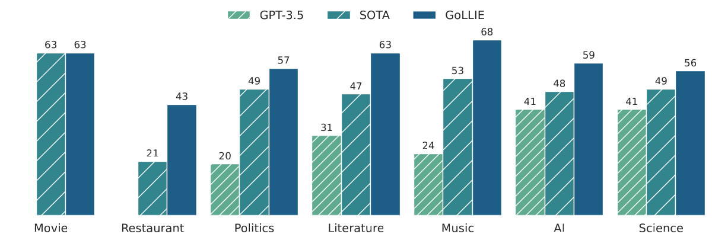
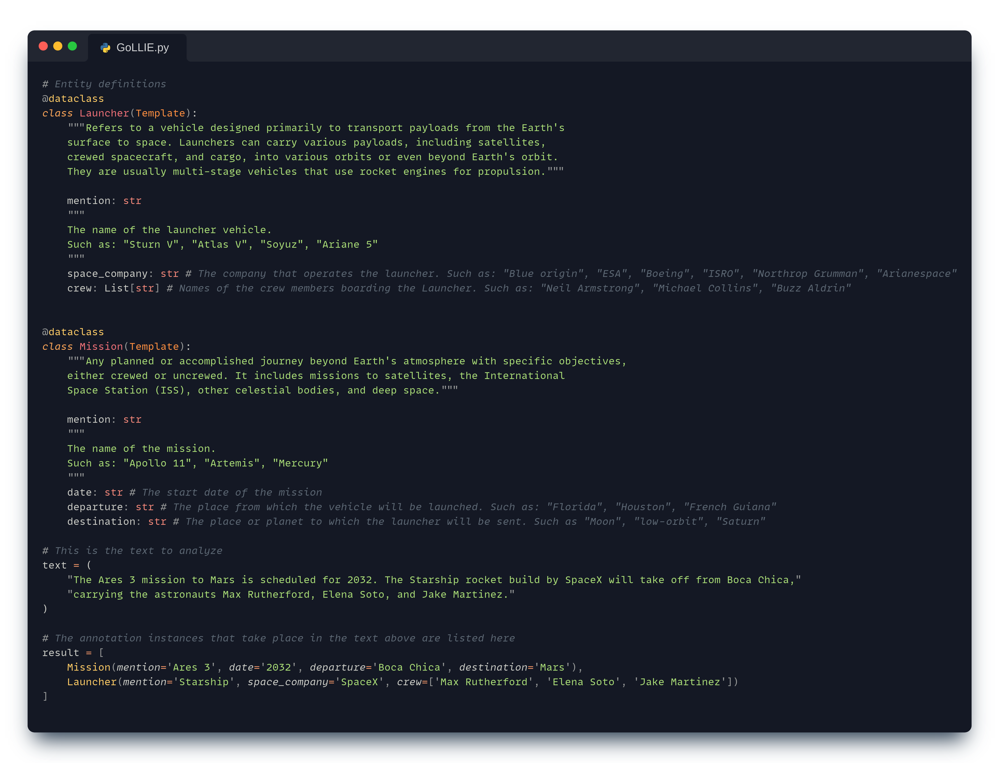
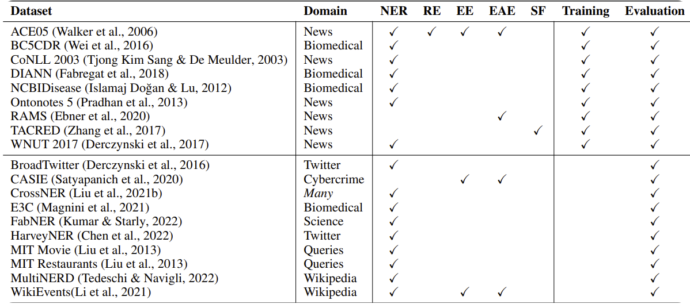

<p align="center">
    <br>
    
    <br>
    <h2 align="center"><b>G</b>uideline f<b>o</b>llowing <b>L</b>arge <b>L</b>anguage Model for <b>I</b>nformation <b>E</b>xtraction</h2>


<p align="center">
    <a href="https://twitter.com/intent/tweet?text=Wow+this+new+model+is+amazing:&url=https%3A%2F%2Fgithub.com%2Fhitz-zentroa%2FGoLLIE"></a>
    <a href="https://github.com/hitz-zentroa/GoLLIE/blob/main/LICENSE"></a>
    <a href="https://huggingface.co/collections/HiTZ/gollie-651bf19ee315e8a224aacc4f"></a>
    <a href="https://hitz-zentroa.github.io/GoLLIE/"></a>
    <a href="https://arxiv.org/abs/2310.03668"></a>
<br>
     <a href="http://www.hitz.eus/"></a>
    <a href="http://www.ixa.eus/?language=en"></a>
    <br>
     <br>
</p>

<p align="justify">
We present   GoLLIE, a Large Language Model trained to follow annotation guidelines. GoLLIE outperforms previous approaches on zero-shot Information Extraction and allows the user to perform inferences with annotation schemas defined on the fly. Different from previous approaches, GoLLIE is able to follow detailed definitions and does not only rely on the knowledge already encoded in the LLM. Code and models are publicly available.

- 📒 Blog Post: [GoLLIE: Guideline-following Large Language Model for Information Extraction](https://hitz-zentroa.github.io/GoLLIE/)
- 📖 Paper: [GoLLIE: Annotation Guidelines improve Zero-Shot Information-Extraction](https://openreview.net/forum?id=Y3wpuxd7u9)
- GoLLIE in the 🤗HuggingFace Hub: [HiTZ/gollie](https://huggingface.co/collections/HiTZ/gollie-651bf19ee315e8a224aacc4f)
- 🚀 Example Jupyter Notebooks: [GoLLIE Notebooks](notebooks/)
</p>

<p align="center">

</p>


## Schema definition and inference example

The labels are represented as Python classes, and the guidelines or instructions are introduced as docstrings. The model start generating after the `result = [` line.
<!---
```Python
# Entity definitions
@dataclass
class Launcher(Template):
    """Refers to a vehicle designed primarily to transport payloads from the Earth's 
    surface to space. Launchers can carry various payloads, including satellites, 
    crewed spacecraft, and cargo, into various orbits or even beyond Earth's orbit. 
    They are usually multi-stage vehicles that use rocket engines for propulsion."""

    mention: str  
    """
    The name of the launcher vehicle. 
    Such as: "Sturn V", "Atlas V", "Soyuz", "Ariane 5"
    """
    space_company: str # The company that operates the launcher. Such as: "Blue origin", "ESA", "Boeing", "ISRO", "Northrop Grumman", "Arianespace"
    crew: List[str] # Names of the crew members boarding the Launcher. Such as: "Neil Armstrong", "Michael Collins", "Buzz Aldrin"
    

@dataclass
class Mission(Template):
    """Any planned or accomplished journey beyond Earth's atmosphere with specific objectives, 
    either crewed or uncrewed. It includes missions to satellites, the International 
    Space Station (ISS), other celestial bodies, and deep space."""
    
    mention: str
    """
    The name of the mission. 
    Such as: "Apollo 11", "Artemis", "Mercury"
    """
    date: str # The start date of the mission
    departure: str # The place from which the vehicle will be launched. Such as: "Florida", "Houston", "French Guiana"
    destination: str # The place or planet to which the launcher will be sent. Such as "Moon", "low-orbit", "Saturn"

# This is the text to analyze
text = (
    "The Ares 3 mission to Mars is scheduled for 2032. The Starship rocket build by SpaceX will take off from Boca Chica,"
    "carrying the astronauts Max Rutherford, Elena Soto, and Jake Martinez."
)

# The annotation instances that take place in the text above are listed here
result = [
    Mission(mention='Ares 3', date='2032', departure='Boca Chica', destination='Mars'),
    Launcher(mention='Starship', space_company='SpaceX', crew=['Max Rutherford', 'Elena Soto', 'Jake Martinez'])
]
```
-->
<p align="center">

</p>

## Installation

You will need to install the following dependencies to run the GoLLIE codebase:
```bash
Pytorch >= 2.0.0 | https://pytorch.org/get-started
We recommend that you install the 2.1.0 version or newer, as it includes important bug fixes.

transformers >= 4.33.1
pip install --upgrade transformers

PEFT >= 0.4.0
pip install --upgrade peft

bitsandbytes >= 0.40.0
pip install --upgrade bitsandbytes

Flash Attention 2.0
pip install flash-attn --no-build-isolation
pip install git+https://github.com/HazyResearch/flash-attention.git#subdirectory=csrc/rotary
```

You will also need these dependencies
```bash
pip install numpy black Jinja2 tqdm rich psutil datasets ruff wandb fschat
```

## Pretrained models
We release three GoLLIE models based on [CODE-LLama](https://huggingface.co/codellama) (7B, 13B, and 34B). The models are available in the 🤗HuggingFace Hub.

| Model | Supervised average F1 | Zero-shot average F1 |                     🤗HuggingFace Hub                     |
|---|:---------------------:|:--------------------:|:---------------------------------------------------------:|
| GoLLIE-7B |         73.0          |         55.3         |  [HiTZ/GoLLIE-7B](https://huggingface.co/HiTZ/GoLLIE-7B)  |
| GoLLIE-13B |         73.9          |         56.0         | [HiTZ/GoLLIE-13B](https://huggingface.co/HiTZ/GoLLIE-13B) |
| GoLLIE-34B |       **75.0**        |       **57.2**       | [HiTZ/GoLLIE-34B](https://huggingface.co/HiTZ/GoLLIE-34B) |

## How to use GoLLIE

Please take a look at our 🚀 Example Jupyter Notebooks to learn how to use GoLLIE: [GoLLIE Notebooks](notebooks/)

## Currently supported tasks

This is the list of task used for training and evaluating GoLLIE. However, as demonstrated in the  🚀 [Create Custom Task notebook](notebooks/Create%20Custom%20Task.ipynb) GoLLIE can perform a wide range of unseen tasks. 
For more info, read our [📖Paper](https://arxiv.org/abs/2310.03668).

<p align="center">

</p>

We plan to continue adding more tasks to the list. If you want to contribute, please feel free to open a PR or contact us. You can use as example the already implemented tasks in the `src/tasks` folder.


## Generate the GoLLIE dataset
The configuration files used to generate the GoLLIE dataset are available in the [configs/data_configs/](configs/data_configs/) folder.
You can generate the dataset by running the following command (See [bash_scripts/generate_data.sh](bash_scripts/generate_data.sh) for more info): 
```bash
CONFIG_DIR="configs/data_configs"
OUTPUT_DIR="data/processed_w_examples"

python -m src.generate_data \
     --configs \
        ${CONFIG_DIR}/ace_config.json \
        ${CONFIG_DIR}/bc5cdr_config.json \
        ${CONFIG_DIR}/broadtwitter_config.json \
        ${CONFIG_DIR}/casie_config.json \
        ${CONFIG_DIR}/conll03_config.json \
        ${CONFIG_DIR}/crossner_ai_config.json \
        ${CONFIG_DIR}/crossner_literature_config.json \
        ${CONFIG_DIR}/crossner_music_config.json \
        ${CONFIG_DIR}/crossner_politics_config.json \
        ${CONFIG_DIR}/crossner_science_config.json \
        ${CONFIG_DIR}/diann_config.json \
        ${CONFIG_DIR}/e3c_config.json \
        ${CONFIG_DIR}/europarl_config.json \
        ${CONFIG_DIR}/fabner_config.json \
        ${CONFIG_DIR}/harveyner_config.json \
        ${CONFIG_DIR}/mitmovie_config.json \
        ${CONFIG_DIR}/mitrestaurant_config.json \
        ${CONFIG_DIR}/mitmovie_config.json \
        ${CONFIG_DIR}/multinerd_config.json \
        ${CONFIG_DIR}/ncbidisease_config.json \
        ${CONFIG_DIR}/ontonotes_config.json \
        ${CONFIG_DIR}/rams_config.json \
        ${CONFIG_DIR}/tacred_config.json \
        ${CONFIG_DIR}/wikievents_config.json \
        ${CONFIG_DIR}/wnut17_config.json \
     --output ${OUTPUT_DIR} \
     --overwrite_output_dir \
     --include_examples
```

**We do not redistribute the datasets used to train and evaluate GoLLIE**. Not all of them are publicly available; some require a license to access them.

For the datasets available in the HuggingFace Datasets library, the script will download them automatically.

For the following datasets, you must provide the path to the dataset by modifying the corresponding [configs/data_configs/](configs/data_configs/) file: [ACE05](https://catalog.ldc.upenn.edu/LDC2006T06) ([Preprocessing script](https://github.com/hitz-zentroa/GoLLIE/blob/main/src/tasks/ace/preprocess_ace.py)), [CASIE](https://github.com/Ebiquity/CASIE/tree/master/data), [CrossNer](https://github.com/zliucr/CrossNER), [DIANN](http://nlp.uned.es/diann/), [E3C](https://github.com/hltfbk/E3C-Corpus/tree/main/preprocessed_data/clinical_entities/English), [HarveyNER](https://github.com/brickee/HarveyNER/tree/main/data/tweets), [MitMovie](https://groups.csail.mit.edu/sls/downloads/movie/), [MitRestaurant](https://groups.csail.mit.edu/sls/downloads/restaurant/), [RAMS](https://nlp.jhu.edu/rams/), [TACRED](https://nlp.stanford.edu/projects/tacred/), [WikiEvents](https://github.com/raspberryice/gen-arg).

If you encounter difficulties generating the dataset, please don't hesitate to contact us.

## How to train your own GoLLIE

First, you need to generate the GoLLIE dataset. See the previous section for more info.

Second, you must create a configuration file. Please, see the [configs/model_configs](configs/model_configs) folder for examples. 

Finally, you can train your own GoLLIE by running the following command (See [bash_scripts/](bash_scripts/) folder for more examples): 
```bash
CONFIGS_FOLDER="configs/model_configs"
python3 -m src.run ${CONFIGS_FOLDER}/GoLLIE+-7B_CodeLLaMA.yaml
```

## How to evaluate a model
First, you need to generate the GoLLIE dataset. See the previous section for more info.

Second, you must create a configuration file. Please, see the [configs/model_configs/eval](configs/model_configs/eval) folder for examples. 

Finally, you can evaluate your own GoLLIE by running the following command (See [bash_scripts/eval](bash_scripts/eval) folder for more examples): 
```bash
CONFIGS_FOLDER="configs/model_configs/eval"
python3 -m src.run ${CONFIGS_FOLDER}/GoLLIE+-7B_CodeLLaMA.yaml
```


## Citation
```bibtex
@inproceedings{
    sainz2024gollie,
    title={Go{LLIE}: Annotation Guidelines improve Zero-Shot Information-Extraction},
    author={Oscar Sainz and Iker Garc{\'\i}a-Ferrero and Rodrigo Agerri and Oier Lopez de Lacalle and German Rigau and Eneko Agirre},
    booktitle={The Twelfth International Conference on Learning Representations},
    year={2024},
    url={https://openreview.net/forum?id=Y3wpuxd7u9}
}
```
